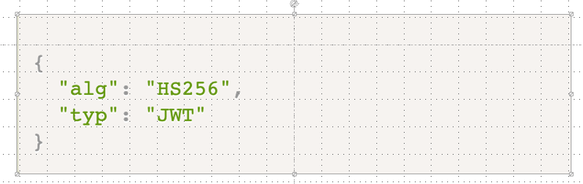

[TOC]

### 项目启动

- 本地启动，首先开启 mongo 服务
  - 使用的是类似于 inter 芯片的安装方式，版本 5.0.7
  - 我的电脑安装地址为 /usr/local/mongodb

`mongod --config /usr/local/mongodb/etc/mongod.conf`

- 进入后端项目 manager-server，安装依赖，`npm install`，开启后端服务`npm run dev`

- 进入再开启前端项目 manager-fe，安装依赖，`npm install`，开启后端服务`npm run dev`

### 1. 项目开发简介

#### 1.1 项目开发流程

- 需求 => 开发 => 测试 => 上线 => 回顾
  
  - 需求： 需求调研、需求设计、需求评审、用例评审
  - 开发： 接口设计、接口评审、前后端开发、CR (Code Review)、自测
  - 测试： Bug 修复、功能优化、需求调整、遗漏功能开发
  - 上线： 预发验证、灰度测试、checklist、权限配置、版本回退
  - 回顾： 事故复盘、问题总结、数据总览

#### 1.2 通用后台

- UI 框架
  
  - Element、AntD、Mint、Vant、WeUI

- 框架
  
  - Vue、React、Angular、Jquery

- 插件/包
  
  - cookie、swiper、lodash、Underscore

- 后台
  
  - Antd-Pro、Vue-Admin、Egg

#### 1.3 课程特点

- 全栈、Vue3 全家桶、ElementPlus、标准前后端、CRUD、JWT、RBAC 权限、审批流、动态菜单

#### 1.4 Vue3 介绍

##### Composition API，独立的模块中使用，一般还是使用 options api 较多

- 定义响应式：ref、reactive
- 入口函数：setup
- 钩子函数：computed、onMounted
- 上下文：getCurrentInstance、globalProperties

#### 1.5 vue3 和 vue2 的语法差异

a. 模板语法未变

- 文本渲染：{{msg}}

- HTML 渲染：{{html}}

- 事件绑定：v-on/ @

- 属性绑定：v-bind/ :
  
  - `< div v-bind:userId="userId"></div>`

- class 绑定
  
  - `<div :class="{active: isActive}"></div>`

- style 绑定
  
  - `<div :style="{color: activeColor, fontSize: fontSize + 'px'}"></div>`

- 条件渲染
  
  - v-if、v-else、v-else-if、v-show

- 循环
  
  - v-for
  
  ```html
  <ul>
    <li v-for="item in items">{{item.message}}</li>
  </ul>
  ```

- 事件修饰符
  
  - .stop、.prevent、.capture、.self、.once、.passive

- 按钮修饰符
  
  - enter、.tab、.delete ...

- 表单绑定
  
  - v-model

- 表单修饰符
  
  - .lazy、number、trim

#### 1.6 Composition API 使用

##### a. 定义 setup 启动函数

```javascript
export default {
  name: 'app',
  setup() {
    // 启动函数
  }
}
```

##### b. 定义响应式变量

```javascript
setup(){
    // 普通类型
    let age = ref(30)
    // 对象类型
    let user = reactive({name: 'jack'})
    return {
        age,
        user
    }
}
```

##### c. 初始化调用

```javascript
setup() {
    onMounted(()=>{
        // 初始化，一般用来调用初始化接口
        console.log('init...')
    })
}
```

##### d. 计算属性调用

```javascript
setup() {
    let age = ref(30)
    let newAge = computed(()=>{
        return age.value + 1;
    })
    return {
        age,newAge
    }
}
```

##### e. 全局对象挂载

```javascript
// main.js
import { createApp } from 'vue'
import App from './App.vue'
import api from './api'
// 对象挂载，这句很重要
app.config.globalProperties.$api = api

// app.vue
export default {
  name: 'app',
  setup() {
    const { ctx } = getCurrentInstance()
    const userList = ref([])
    // 获取用户列表
    const getUserList = async () => {
      let params = { id: 1 }
      try {
        // 通过ctx调用接口
        const { list, page } = await ctx.$api.getUserList(params)
        userList.value = list
      } catch (error) {}
    }
    return {
      getUserList
    }
  }
}
```

##### f. Provider/Inject

- 主要用于组件之间数据传递，如果数据复杂一般会使用 Redux 进行存储，如果业务简单，可以使用 Provider/Inject 来直接传递。Provider 主要是提供数据，Inject 主要用于接收数据。

虽然 Composition API 是 Vue3 新语法，但是不推荐所有页面都使用它来开发，官方介绍的是通过它可以防止方法来回横跳，所以如果是独立模块封装或者独立组件调用，我们可以基于 Composition API 来开发，但是常规页面，还是 Options API 方便，大家千万不要误导。

[summary](./images/summary.png)

### 2. 项目初始化

#### 2.1 初始化、目录规范

##### a. 全局安装 vue 脚手架

```javascript
npm install @vue/cli -g
// or
cnpm install @vue/cli -g
// or
yarn global add @vue/cli
```

- vue --version 可以查看版本，4.x 以上可以支持创建 vue3 项目

- 版本升级
  
  - npm update -g @vue/cli

##### b. 通过 vite 创建项目

创建项目

```javascript
npm init @vitejs/app
// or
cnpm init @vitejs/app
// or
yarn create @vitejs/app manager-fe
```

##### c. 安装项目所需插件

```
# 安装项目生产依赖
yarn add vue-router vuex element-plus axios -
# 安装项目开发依赖
yarn add sass -S
```

#### 2.2 目录结构

```
manager-fe
    dist
    node_modules
    public
    src
        api
        assets
        components
        config
        router
        store
        utils
        views
        App.vue
        main.js
    .gitignore
    .env.dev
    .env.test
    .env.prod
    index.html
    package.json
    vite.config.js
    yarn.lock
```

#### 2.3 路由封装

- 在 scr 目录的 router 目录下创建 index.js 文件，写入下面内容

```javascript
import { createRouter, createWebHashHistory } from 'vue-router'
import Home from './../components/Home.vue'
import Welcome from './../components/Welcome.vue'
import Login from './../components/Login.vue'
const routes = [
  {
    name: 'home',
    path: '/',
    meta: {
      title: '首页'
    },
    component: Home,
    redirect: '/welcome',
    children: [
      {
        name: 'welcome',
        path: '/welcome',
        meta: {
          title: '欢迎页'
        },
        component: Welcome
      },
      {
        name: 'login',
        path: '/login',
        meta: {
          title: '登录页'
        },
        component: Login
      }
    ]
  }
]
const router = createRouter({
  history: createWebHashHistory(),
  routes
})
export default router
```

#### 2.4 环境配置

- 在 src 目录的 config 目录下创建 index.js 文件，写入下面内容

```javascript
/**
 * 环境配置封装
 */
const env = import.meta.env.MODE || 'prod'
const EnvConfig = {
  dev: {
    baseApi: '/',
    mockApi: '' // 开发环境需要访问mock，提测之后才会访问测试环境地址
  },
  test: {
    baseApi: '//test.futurefe.com/api',
    mockApi: ''
  },
  prod: {
    baseApi: 'futurefe.com/api',
    mockApi: ''
  }
}
export default {
  env: 'dev',
  mock: true, // 接口是否支持mock，整个项目使用mock方式
  // baseApi: 'www.baidu.com/api' // test-www
  ...EnvConfig[env]
}
```

#### 2.5 axios 的二次封装

- 在 src 目录下的 utils 目录下创建 request.js 文件

- 实例化 axios 对象

- 创建请求响应的拦截器

- 导出模块 `export default request`

- 在 main.js 中引入并挂载到全局

```javascript
import request from './utils/request'
const app = createApp(App)
app.config.globalProperties.$request = request
```

#### 2.6 storage 二次封装

localStorage 可以存储基本数据类型，对于引用数据类型，如

`localStorage.setItem("user", [{name: 'jack'}])` 存进去之后识别就是 object object

**可以用 JSON.stringify 来转换成字符串**

- 在 utils 目录下创建 storage.js 文件

```javascript
/**
 * Storage 二次封装
 * @author lqj
 */
import config from './../config'
export default {
  setItem(key, val) {
    let storage = this.getStorage()
    storage[key] = val
    window.localStorage.setItem(config.namespace, JSON.stringify(storage))
  },
  getItem(key) {
    return this.getStorage()[key] // 获取的是属性值
  },
  getStorage() {
    return JSON.parse(window.localStorage.getItem(config.namespace) || '{}')
  },
  clearItem(key) {
    let storage = this.getStorage()
    delete storage[key]
    // 删除之后还需要重新写入
    window.localStorage.setItem(config.namespace, JSON.stringify(storage))
  },
  clearAll() {
    window.localStorage.clear()
  }
}
```

#### 2.7. 主页结构布局

```javascript
<div class="wrapper">
  <div class="main-page">
    <router-view></router-view>
  </div>
</div>
```

- 通过在 router-view 外设置 class 方法统一对各个路由子页面进行样式的设置

#### 2.8 架构师

##### a. 架构师的作用

- 系统设计

- 技术布局

- 疑难问题攻克

- 前端规范制定

- 前端工程化实践

- 指导中高级工程师

##### b. 系统架构设计需要考虑哪些

1. 手动构建或基于 Cli 构建基础项目

2. 提前设计好项目整体架构能力
- 目录结构

- 工具函数

- 开发规范(Eslint)

- 多套环境

- Mock

- Cookie/Storage/Axios 等插件封装

- 路由封装

- 系统整体布局
3. CodeReview 流程

4. Git 提交规范

5. VSCode 配置规范

6. 开发独有的脚手架

7. 工程化（自动构建、自动部署 CI/CD）

##### c. 业务方面需要考虑哪些

1. 动态路由

2. 菜单、按钮权限、数据权限

3. 业务模块封装

4. 组件提取

5. UI 框架设计

6. 数据埋点设计

7. 通用后台设计

8. H5 架构方案

9. 小程序架构方案

##### d. 路由封装-路由跳转的三种方式

1. `router-link`
   
   ```javascript
   <router-link to="/login"> 去登录 </router-link>
   ```

2. 传统跳转：`this.$router.push`
   
   ```javascript
   <template>
       <el-button @click="goHome">回首页</el-button>
   </template>
   
   <script>
   export default{
       name:'login',
     methods:{
       goHome(){
         this.$router.push('/welcome')
       }
     }
   }
   </script>
   ```

3. Composition API 跳转
   
   ```javascript
   <script setup>
     import {useRouter} from 'vue-router' let router = useRouter() const goHome = ()=>{route.push('/login')}
   </script>
   ```

### 3. Koa 架构设计

#### 3.1 Koa2 项目初始化操作

> 通常我们可以借助于脚手架，快速创建一个 Koa2 项目，当然也可以自己从头搭建；脚手架会帮助我们提前搭好基本的架子。

##### 3.1.1. koa-generator 快速生成 koa 服务的脚手架工具

a. 全局安装脚手架工具

```bash
cnpm install -g koa-generator
#or
yarn global add koa-generator
```

b. 进入到项目文件夹目录，执行生成命令

```bash
koa2 manager-server
```

> 如果无法使用 koa2 命令，说明需要配置环境变量，window 用户，需要找到 koa-generator 的安装目录，找到里面 bin 下面的 koa2 命令文件，然后配置到环境变量中。mac 用户可直接创建软连接，指向到/usr/local/bin 中，比如：ln -s /Users/Jack/.config/yarn/global/node_modules/koa-generator/bin/koa2 /usr/local/bin/koa2

c. 安装依赖

```bash
npm install
#or
cnpm install
#or
yarn
```

d. 启动服务

```bash
yarn start
#or
node .bin/www
# 默认访问网址 localhost:3000/
```

##### 3.2 koa-generator 创建的 koa2 框架目录

```markdown
|-- koa-server
|-- app.js #根入口
|-- package-lock.json
|-- package.json #项目依赖包文件
|-- bin
| |-- www #运行启动文件
|-- public #公共资源
| |-- images
| |-- javascripts
| |-- stylesheets
| |-- style.css
|-- routes
| |-- index.js #定义了 localhost:3000/之下的路由
| |-- users.js #定义了 localhost:3000/users/之下的路由
|-- views #视图 Pug 是一款 HTML 模板引擎，专门为 Node.js 平台开发
|-- error.pug
|-- index.pug
|-- layout.pug
```

##### 3.2.1 使用 pm2 部署 Koa 项目并实现启动、关闭、自动重启

a. 全局安装

```
npm install -g pm2
```

b. 启动项目

> 进入项目目录，然后使用 pm2 启动项目。这里要特别注意：启动**单文件**时用（app.js 是项目文件名）

```
pm2 start app.js   # 启动单文件
```

> 但是在 Koa2 中需要这样启动

```
pm2 start ./bin/www  # 启动koa2项目
```

c. pm2 自动重启

> 把 pm2 的服务先停下，然后起来的时候带上 -watch 就可以了

```
pm2 start ./bin/www --watch
```

d. 启动完成，可以访问了

e. pm2 相关命令（www 是项目名字）

```
pm2 list           #查看所有已启动项目
pm2 start          #启动
pm2 restart www    #重启
pm2 stop www       #停止
pm2 delete www     #删除
```

#### 3.2 应用 log4js 进行日志规范封装

```javascript
const logger = log4js.getLogger('cheese')
log.level = 'error' // 下面的等级依次递增，当设置error时候，只有error和fatal可以打印出来
logger.trace('entering cheese testing')
logger.debug('entering cheese testing')
logger.info('entering cheese testing')
logger.warn('entering cheese testing')
logger.error('entering cheese testing')
logger.fatal('entering cheese testing')
```

#### 3.3 Mongo 安装配置

**（如果不使用 homebrew,也可以参考 intel 芯片方式安装）**

方法一：使用 brew，基本不需要自己配置（推荐）

```
brew tap mongodb/brew
brew install mongodb-community

# MacBook M1芯片的默认配置目录如下：
/opt/homebrew/etc/mongod.conf
# MacBook Intel芯片的默认配置目录如下：
/usr/local/etc/mongod.conf
//注意：以上路径是通过brew包管理器安装的默认路径，其他方式安装的未测试

# 安装完之后配置环境变量
echo 'export PATH="/opt/homebrew/opt/mongodb-community@4.4/bin:$PATH"' >> ~/.zshrc
```

```
# 打开配置文件编写
sudo vim /opt/homebrew/etc/mongod.conf
# mongod.confg 内容
systemLog:
  # syslog输出到终端,file输出到文件
  destination: file
  # 日志文件的路径，当destination设置为file必填
  path: /opt/homebrew/var/log/mongodb/mongo.log
  # 是否以追加形式生成日志,true 追加,false备份原来的，并生成新的日志文件
  logAppend: true
# 数据库路径
storage:
  dbPath: /opt/homebrew/var/mongodb
# 网络配置
net:
  # 默认127.0.0.1,只能本机,要允许所有ip,使用0.0.0.0
  bindIp: 127.0.0.1
  # 端口（默认27017-27019）
  port: 27017
# 进程方式
processManagement:
  # 开启守护进程,如果fork为false,直接ctrl+c停止服务,true的话关闭麻烦些
  fork: false
```

```
# 查看环境变量是否配置成功
echo $PATH
# 验证mogodb是否安装成功
mongod -version
```

系统文件所在位置

|                    | Intel 处理器                  | Apple M1 处理器                  |
| ------------------ | -------------------------- | ----------------------------- |
| configuration file | /usr/local/etc/mongod.conf | /opt/homebrew/etc/mongod.conf |
| log directory      | /usr/local/var/log/mongodb | /opt/homebrew/var/log/mongodb |
| data directory     | /usr/local/var/mongodb     | /opt/homebrew/var/mongodb     |

**启动/停止 Mongo 服务,链接数据库**

- 作为服务

**MongoDB（即 mongod 进程）作为 macOS 服务运行（推荐，不需要手动运行）**

```
# 启动
brew services start mongodb-community@4.4
# 停止
brew services stop mongodb-community@4.4


# 验证mongodb正在运行
brew services list
```

- 手动

**手动运行 MongoDB（即 mongod 进程）作为后台进程**

```
# 启动
intel 处理器
mongod --config /usr/local/etc/mongod.conf --fork
M1 处理器
mongod --config /opt/homebrew/etc/mongod.conf --fork


# 关闭
如果之前的配置文件里 fork 为 false 的话，直接 ctrl + c 停止服务。
# 如 果 fork 为 true , 使用以下两种方法都可以。
# 方法一：通过查杀进程的方式，查看进程，使用 kill 命令；不能使用kill -9，为什么不能使用kill -9 请百度 kill 与 kill -9 的区别
# 通常启动服务成功，会输出服务的进程ID，也可以使用以下命令来查看ID
ps aux | grep -v grep | grep mongod
# 方法二：在客户端进去，使用shutdown命令
> use admin;
switched to db admin
> db.shutdownServer();
server should be down...
# 在主节点（primary）上运行shutdown命令时，服务器在关闭之前
# 会先等待备份节点追赶主节点以保持同步。这将回滚的可能性降至最低
# 但shutdown操作有失败的可能性。如几秒钟内没有备份节点成功同步
# 则shutdown操作失败，主节点不会停止运行。
```

```
# 开始使用 mongodb
mongo
# 指定端口运行
mongo --port 57017
```

方法二：

- 下载压缩包并解压

- 创建软链接
  
  ```
  ln -s /mongodb安装目录/mongod /usr/local/bin/mongod
  ln -s /mongodb安装目录/mongo /usr/local/bin/mongo
  ```

- 创建配置文件
  
  data: 数据库目录
  
  log: 日志目录
  
  conf: 配置目录
  
  ```properties
  # 数据库路径
  dbpath=/Users/liqinjian/software/mongodb-macos-x86_64-4.4.13/mongo/data
  # 日志输出文件路径
  logpath=/Users/liqinjian/software/mongodb-macos-x86_64-4.4.13/mongo/log/mongo.log
  # 错误日志采用追加模式
  logappend=true
  # 启用日志文件，默认启用
  journal=true
  # 这个选项可以过滤掉一些无用信息，如果需要调试使用需要设置false
  quiet=true
  # 端口号，默认 27017
  port=27017
  # auth = true
  fork=true
  ```

- 启动服务
  
  ```bash
  mongod --confg /Users/liqinjian/software/mongodb-macos-x86_64-4.4.13/mongo/config/mongo.confg
  ```

#### 3.4 Mongo 语法

| SQL              | Mongo            |
| ---------------- | ---------------- |
| 表 (Table)        | 集合 (collection)  |
| 行 (Row)          | 文档 (Document)    |
| 列 (Col)          | 字段 (Field)       |
| 主键 (Primary Key) | 对象 ID (ObjectId) |

##### 3.4.1 数据库操作

- 创建数据库： use demo

- 查看数据库：show dbs

- 删除数据库：db.dropDatabase()

##### 3.4.2 集合操作

- 创建集合：db.createCollection(name)

- 查看集合：show collections

- 删除集合：db.collection.drop()

##### 3.4.3 文档操作

- 创建文档：db.collection.insertOne({})、db.collection.insertMany([])

- 查看文档：db.collections.find({})

- 删除文档：db.collection.deleteOne()、db.collection.deleteMany()

- 更新文档：db.collection.update({},{},false,true)
  
  - 参数：查的值、替换的值、没有查找到是否插入新的文档、是否批量更新

##### 3.4.4 条件操作

```
大于 $gt; 小于 $lt; 大于等于 $gte; 小于等于 $lte
```

### 4. 接口文档设计

后端开发

- 理解需求

- 关键功能技术评审

- 设计表结构

- 设计接口文档

- 接口功能实现

- 接口联调、自测、提测

#### 4.1 接口文档形式

##### Swagger、YAPI、EasyMock、MarkDown

### 5. 登录布局开发

- 登录表单居中样式

- ```css
  .login-wrapper {
    display: flex;
    justify-content: center;
    align-items: center;
    background-color: #f9fcff;
    width: 100vw;
    height: 100vh;
    .modal {
      width: 500px;
      padding: 50px;
      background-color: #fff;
      border-radius: 40px;
      box-shadow: 0px 0px;
    }
  }
  ```

#### 5.1 登录页面后台开发

- mongoose 是 MongoDB 的上层应用插件
- 开发步骤

##### a. 创建 utils 文件夹，并创建消息提示文件 log4j.js 和 请求工具文件 utils.js

```javascript
// log4j.js
/**
 * 日志存储
 * @author lqj
 */
const log4js = require('log4js')
const levels = {
  trace: log4js.levels.TRACE,
  debug: log4js.levels.DEBUG,
  info: log4js.levels.INFO,
  warn: log4js.levels.WARN,
  error: log4js.levels.ERROR,
  fatal: log4js.levels.FATAL
}
log4js.configure({
  appenders: {
    console: { type: 'console' },
    info: {
      type: 'file',
      filename: 'logs/all-logs.log' // info错误输出到常规的文件
    },
    error: {
      type: 'dateFile',
      filename: 'logs/log',
      pattern: 'yyyy-MM-dd.log', // 错误按天输出到文件
      alwaysIncludePattern: true // 设置文件名称为 filename + pattern
    }
  },
  categories: {
    default: {
      appenders: ['console'], // 上线的时候需要把console删除，不让输出到控制台
      level: 'debug'
    },
    info: {
      appenders: ['info', 'console'],
      level: 'info'
    },
    error: {
      appenders: ['error', 'console'], // error错误追加到这两种错误级别
      level: 'error'
    }
  }
})
/**
 * 日志输出，level为debug
 * @param {string} content
 */
exports.debug = content => {
  let logger = log4js.getLogger()
  logger.level = levels.debug
  logger.debug(content)
}
exports.info = content => {
  let logger = log4js.getLogger('info')
  logger.level = levels.info
  logger.info(content)
}
exports.error = content => {
  let logger = log4js.getLogger('error') // 传入的是 categories 中的名称
  logger.level = levels.error
  logger.error(content)
}
```

请求工具文件 utils.js

```javascript
/**
 * 通用工具函数
 */
const log4js = require('./log4j')
const CODE = {
  SUCCESS: 200,
  PARAM_ERROR: 10001, //参数错误
  USER_ACCONT_ERROR: 20001, // 账号或密码错误
  USER_LOGIN_ERROR: 30001, // 用户未登录
  BUSINESS_ERROR: 40001, // 业务请求失败
  AUTH_ERROR: 50001 // 认证失败或TOKEN过期
}
module.exports = {
  /**
   * 分页结构封装
   * @param {number} pageNum
   * @param {number} pageSize
   * @returns
   */
  pager({ pageNum = 1, pageSize = 10 }) {
    pageNum *= 1 // 字符串转成数字
    pageSize *= 1
    const skipIndex = (pageNum - 1) * pageSize // 下一个索引值
    return {
      page: {
        pageNum,
        pageSize
      },
      skipIndex
    }
  },
  success(data = '', msg = '', code = CODE.SUCCESS) {
    log4js.debug(data)
    return {
      code,
      data,
      msg
    }
  },
  fail(msg = '', code = CODE.BUSINESS_ERROR, data = '') {
    log4js.debug(msg)
    return {
      code,
      data,
      msg
    }
  }
}
```

##### b. 创建用户数据模型，创建 models 文件夹，创建 userSchema.js 文件

```javascript
// userSchema.js
/**
 * 用户模型
 */
const mongoose = require('mongoose')
const userSchama = mongoose.Schema({
  userId: Number, //用户ID，自增长
  userName: String, //用户名称
  userPwd: String, //用户密码，md5加密
  userEmail: String, //用户邮箱
  mobile: String, //手机号
  sex: Number, //性别 0:男  1：女
  deptId: [], //部门
  job: String, //岗位
  state: {
    type: Number,
    default: 1
  }, // 1: 在职 2: 离职 3: 试用期
  role: {
    type: Number,
    default: 1
  }, // 用户角色 0：系统管理员  1： 普通用户
  roleList: [], //系统角色
  createTime: {
    type: Date,
    default: Date.now()
  }, //创建时间
  lastLoginTime: {
    type: Date,
    default: Date.now()
  }, //更新时间
  remark: String
})
// 参数1: 定义的模型; 2:配置名称; 3: 关联到数据库的集合的名称
module.exports = mongoose.model('users', userSchama, 'users')
```

##### c. 创建用户请求模块的路由，创建 routes 文件夹，创建 users.js 文件，通过导入数据模型来查数据

```javascript
// users.js
/**
 * 用户管理模块
 */
const router = require('koa-router')()
// 导入用户模型
const User = require('./../models/userSchama')
const util = require('./../utils/utils')
router.prefix('/users')
// 路由
router.post('/login', async ctx => {
  try {
    // 通过ctx可以得到请求参数,get通过query,post通过body
    const { userName, userPwd } = ctx.request.body
    // 返回的是promise
    const res = await User.findOne({
      userName, // key-value的简写
      userPwd
    })
    if (res) {
      ctx.body = util.success(res)
    } else {
      ctx.body = util.fail('账号密码不正确')
    }
  } catch (error) {
    ctx.body = util.fail(error.msg)
  }
})

module.exports = router
```

##### d. 创建 config 文件夹，存放数据库连接配置文件 db.js 和 index.js

```javascript
// index.js
/**
 * 配置文件
 */
module.exports = {
  URL: 'mongodb://127.0.0.1:27017/imooc-manager'
}
```

```javascript
// db.js
/**
 * 数据库连接
 */
const { default: mongoose } = require('mongoose')
const mangoose = require('mongoose')
const config = require('./index')
const log4js = require('./../utils/log4j')
// 数据库链接不需要加引号
mongoose.connect(config.URL, {
  useNewUrlParser: true,
  useUnifiedTopology: true
})
const db = mongoose.connection
db.on('error', () => {
  log4js.error(`****数据库连接失败****${config.URL}`)
})
db.on('open', () => {
  log4js.info('****数据库连接成功****')
})
```

#### 5.2 登录页面需要掌握的知识

##### components 和 views 区别

- components 通常放业务组件
- views 通常放页面（视图）

##### 路由创建方式

```javascript
import { createRouter, createWebHashHistory } from 'vue-router'
const router = createRouter({
  history: createWebHashHistory(),
  routes: []
})
```

##### 什么是路由按需？

路由按需指的是页面首次加载的时候只会加载基础包，不包含对应路由代码，当访问对应页面时，才会加载对应文件。

```javascript
const routes = [
  name:'home',
  path:'/home',
  component:()=>import('home.vue')
]
```

##### 怎么理解 vw 和 vh?

vw 和 vh 是 css3 中的新特性，是一种视口单位。在目前 PC/H5 中广泛使用，vw 主要是可视区域宽度，vh 主要是可视区域高度。通过这种视口单位可实现自适应布局。

1vw = 1% 100vw = 屏幕可视宽度 100vh = 屏幕可视高度 calc(100vw - 50px) = 动态计算 屏幕宽度 - 50px ,注意：减号 前后必须有空格。设置后超出会出现滚动条。

##### Vue3 全局对象挂载

在 Vue2 中我们一般通过原型进行挂载，比如：

```javascript
Vue.prototype.$axios = axios
```

Vue3 中由于没有 vue 实例对象，因此我们需要通过另外一种方式：

```javascript
import App from 'app.vue'
const app = createApp(App)
app.config.globalProperties.$axios = axios;
// 使用 Options API
login() {
    this.$axios.get('/login')
}
// composition API
const instance = getCurrentInstance()
instance.appContext.config.globalProperties.$axios.get('/login')
```

### 6. 前台首页实现

#### 6.1 路由相关

- 子路由如果要复用父路由的路径，就不可以加 /，不然就变成绝对路径了

```javascript
const routes = [
  {
    name: 'home',
    path: '/',
    meta: {
      title: '首页'
    },
    component: Home,
    redirect: '/welcome',
    children: [
      {
        name: 'welcome',
        path: '/welcome',
        meta: {
          title: '欢迎页'
        },
        component: () => import('./../views/Welcome.vue')
      },
      {
        name: 'user',
        path: 'user',
        meta: {
          title: '用户管理'
        },
        component: () => import('./../views/Welcome.vue'),
        children: [
          {
            name: 'info',
            path: 'info',
            meta: {
              title: '信息统计'
            },
            component: () => import('./../views/Welcome.vue')
          }
        ]
      }
    ]
  },
  {
    name: 'login',
    path: '/login',
    meta: {
      title: '登录'
    },
    component: () => import('./../views/Login.vue')
  }
]
```

- `this.$route` 可以打印出路由的所有信息

#### 6.2 vite 配置

- vite 中组件地址必须带后缀 .vue，而 webpack 不用
  
  ```javascript
  import('./../views/Welcome.vue')
  import('./../views/Welcome') // 错误
  ```

- vite 可以配置别名，解决 ./../ 的问题，类似于 Vue 中的 @
  
  ```javascript
  resolve: {
      alias: {
          '@': path.resolve(__dirname, './src')
      }
  }
  ```

- 全局的 mixin 样式问题，可以通过 vite 进行配置
  
  ```javascript
  css: {
    preprocessorOptions: {
      scss: {
        additionalData: `@import '@/assets/style/base.scss'`
      }
    }
  }
  ```

### 7. JWT(JSON Web Tokens)

#### 7.1 什么是 JWT

- JWT 是一种跨域认证解决方案

#### 7.2 解决问题

- 数据传输简单、高效

- jwt 会生成签名，保证传输安全

- jwt 具有时效性

- jwt 更高效地利用集群做好单点登录

#### 7.3 原理

- 服务器认证后，生成一个 JSON 对象，后续通过 json 进行通信

#### 7.4 数据结构

- Header(头部)、Payload(负载)、Signature(签名)

- JWT TOKEN
  
  - Header.Payload.Sigatu``re 组成

- Header 结构
  
  ```json
  "alg": "HS256",  // 加密算法
  "typ": "JWT"  // 加密类型
  ```

- Payload 结构
  
  ```
  iss(issure): 签发人
  exp(expiration time): 过期时间
  sub(subject): 主题
  aud(audience): 受众
  nbf(not before): 生效时间
  iat(issued at): 签发时间
  jti(jwt id): 编号
  
  // example
  {
      "sub": '1111111',
      "name": 'jql',
      "admin": true
  }
  ```

#### 7.5 jsonwebtoken 插件

- 要手动去拼接 header、payload、以及使用加密算法生成 token 需要一定步骤，而插件 jsonwebtoken 已经帮我们封装好，只需要传入 json，就可以生成一个 token。

- 后端项目中
  
  - 安装插件 `npm install jsonwebtoken`
  
  - 在用户发来的请求处理，routers/users.js 文件中处理
  
  ```javascript
  // 路由
  router.post('/login', async ctx => {
    try {
      // 通过ctx可以得到请求参数,get通过query,post通过body
      const { userName, userPwd } = ctx.request.body
      // 返回的是promise
      const res = await User.findOne({
        userName, // key-value的简写
        userPwd
      })
      const data = res._doc
      const token = jwt.sign(
        {
          data: data
        },
        'lqj',
        { expiresIn: 30 }
      ) // 密钥 lqj, 过期时间 30s
      if (res) {
        data.token = token
        ctx.body = util.success(res)
      } else {
        ctx.body = util.fail('账号密码不正确')
      }
    } catch (error) {
      ctx.body = util.fail(error.msg)
    }
  })
  ```

#### 7.6 Token拦截

- 首先在server目录下安装 koa-jwt 中间件

```javascript
// server项目下的 app.js
// 对所有请求的接口做一个拦截
// logger
app.use(async (ctx, next) => {
  // const start = new Date()
  // await next()
  // const ms = new Date() - start
  // console.log(`${ctx.method} ${ctx.url} - ${ms}ms-----ssssssssssssssssssss`)
  // log4js.info(`===========log output==========`)
  log4js.info(`get params: ${JSON.stringify(ctx.request.query)}`)
  log4js.info(`post params: ${JSON.stringify(ctx.request.body)}`)
  await next().catch(err => {
    if (err.status == '401') {
      ctx.status = 200
      ctx.body = utils.fail('Token认证失败', utils.CODE)
    } else {
      throw err
    }
  })
})
// 使用koa-jwt
app.use(koajwt({ secret: 'imooc' })) // 任何一个接口进来都会经过这里过滤，校验token是否有效
```

> 但是需要过滤掉登录和注册接口，不要让它们因为token而被拦截

```javascript
app.use(
  koajwt({ secret: 'imooc' }).unless({
    path: [/^\/api\/users\/login/]
    path: [/^\/api\/users\/login/]  // 这种也可
  })
) // 任何一个接口进来都会经过这里过滤，校验token是否有效
```

请求 /login 接口后端代码为：

```javascript
// 路由,前端请求/login
router.post('/login', async ctx => {
  try {
    // 通过ctx可以得到请求参数,get通过query,post通过body
    const { userName, userPwd } = ctx.request.body
    // 返回的是promise
    /**
     * 返回数据库指定的字段有三种方式
     * 1. 字符串加空格 'userId userName userEmail state role deptId roleList'
     * 2. json，1返回;0/默认 不返回 {userId: 1, userPwd: 0}
     * 3. sql方式，select ('userId')
     */
    // 从后端数据库查找账号密码并判断
    const res = await User.findOne(
      {
        userName, // key-value的简写
        userPwd
      },
      'userId userName userEmail state role deptId roleList'
    )
    const data = res._doc
    console.log('data=>', data)
    // jwt 加密
    const token = jwt.sign(
      {
        data: data
      },
      'imooc',
      { expiresIn: 30 }
    ) // 密钥 imooc, 过期时间 30s
    if (res) {
      data.token = token
      ctx.body = util.success(res)
    } else {
      ctx.body = util.fail('账号密码不正确')
    }
  } catch (error) {
    ctx.body = util.fail(error.msg)
  }
})
```

#### 7.7 传统登录做法是如何记住用户身份信息

登录看似一个简单的功能，实际上随着业务的增多、公司规模扩大，对登录的要求会越来越高。过去在JSP/ASP/PHP时代，可能服务端写个session就搞定了，前端一个登录接口即可。**但现在考虑到单点登录、身份加密、OAuth授权。**

###### SessionID

http本身是无状态的，服务端和前端通信是互相不认识的，为了能够记住每个访问的用户身份，引入了Session概念，它是一张服务端缓存技术。当用户访问服务端时，服务端会生成一个Sessionld作为唯一标识保存在内存中，并写入用户浏览器cookie中，当用户下次访问时，会携带这个cookie，服务端根据Sessionld来判断用户身份。

###### Cookie

Cookie是前端浏览器的特性，跟Session有相似之处，但一般我们都不用Sessionld作为唯一身份。当用户登录以后，**服务端会返回一个userld作为用户唯一值**，前端获取到登录信息后，可自行写入Cookie或者由服务端写入Cookie，下次访问页面时，可判断Cookie信息来识别用户身份，但是这种Cookie方式不安全。

###### JWT

JWT是一种综合技术方案，即能保证安全，又能使用简单，同时具有时效性，目前也是主流的技术方案。具体用法可参考本周总结部分。

###### OAuth

OAuth本身是一种单点登录协议，当公司体量大了以后，会存在很多业务系统，但是不可能每套系统都做一遍登录功能，因此可通过OAuth
做登录授权，一次登录即可访问全战系统，最有名的当属微信的授权登录。大家访问公众号的时候，如果想要获取用户头像等信息就需要做
微信登录授权，就是基于OAuth协议。

#### 7.8 JWT 总结

- 什么是 JWT?
  
  - JWT 是一种跨域认证解决方案

- 解决问题
  
  - 数据传输简单、高效
  
  - 会生成签名，保证传输安全
  
  - 更具有时效性
  
  - 更高效利用集群做好单点登录

- <mark>原理</mark>
  
  - **服务器认证后，生成一个JSON对象，后续通过json进行通信**

- 数据结构
  
  - Header 头部
  
  - Payload 负载
  
  - Signature 签名
  
  

- header结构
  
  

- payload结构
  
  

- 签名：
  
  - HMACSHA256(base64UrlEncode(header) + “."+base64UrlEncode(payload),secret)

- 使用
  
  - /api?token=xxx
  
  - cookie写入token
  
  - storage写入token，请求头添加：Authorization: Bearer
